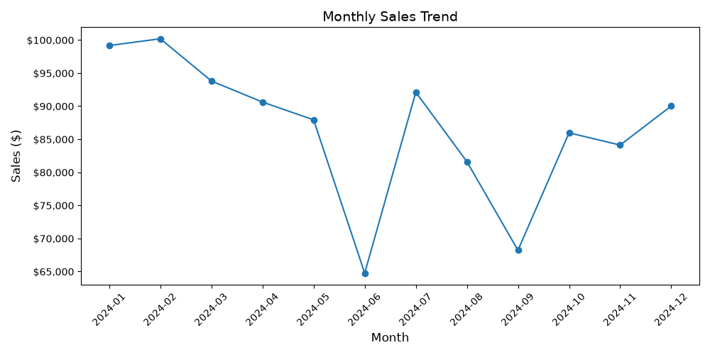
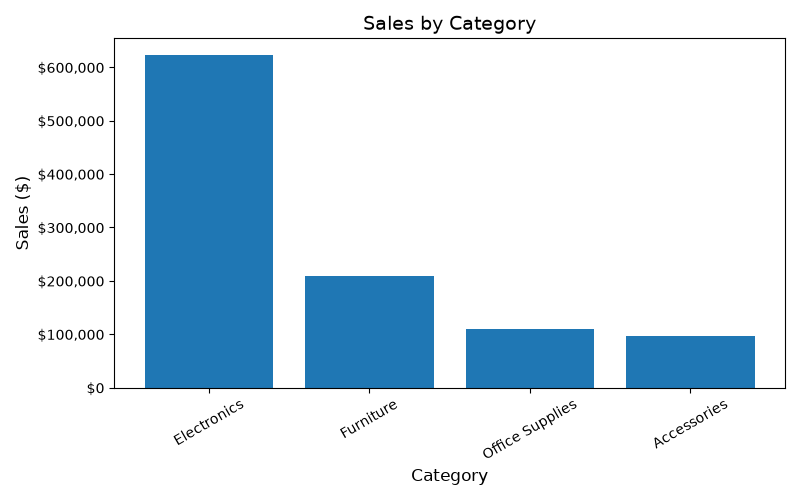
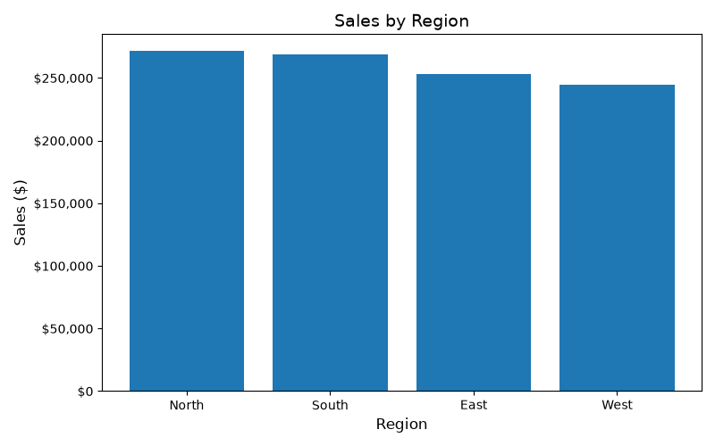
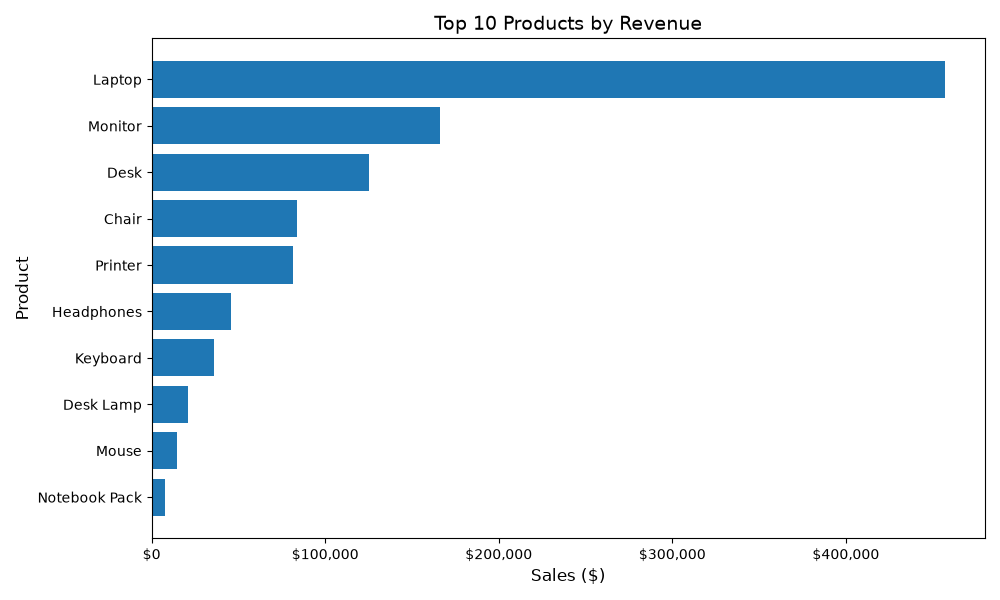
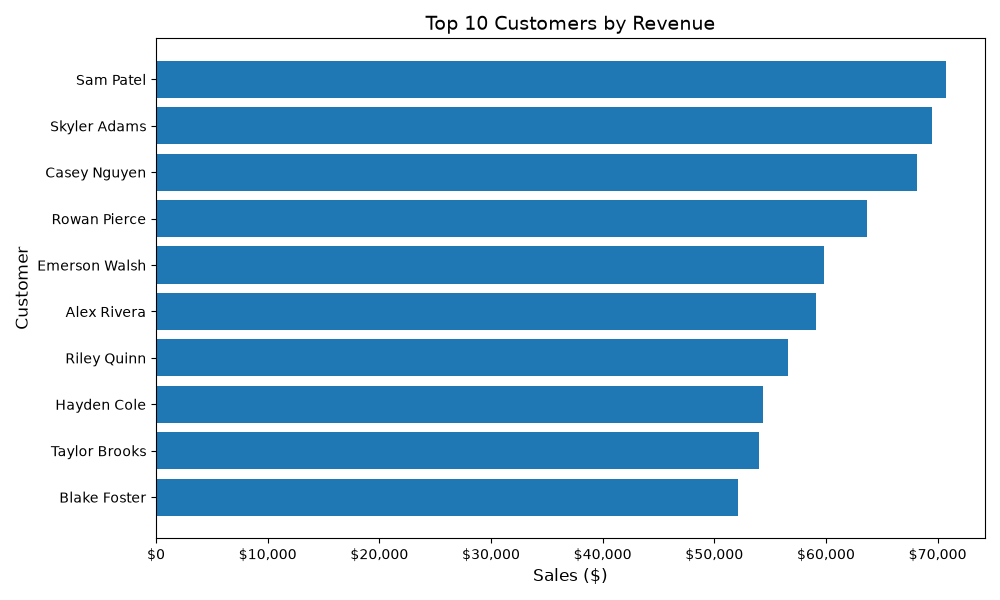
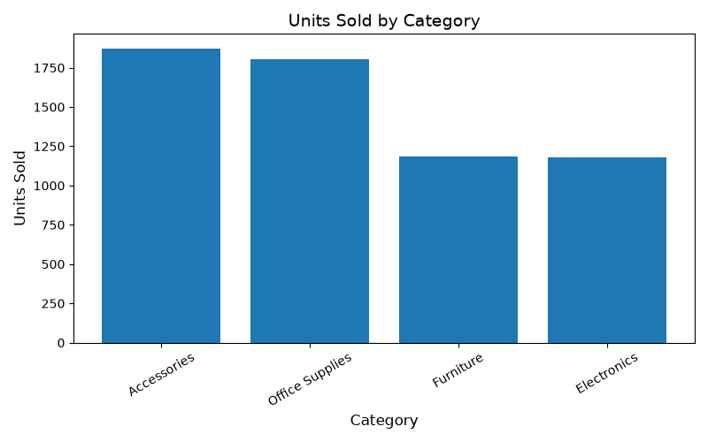

# Sales Analytics & Business Intelligence Dashboard

An end-to-end sales analytics and business intelligence project that demonstrates data generation, data cleaning, ETL processing, SQL analysis, business intelligence, interactive visualization, and dashboard deployment using Python, Pandas, SQLite, Plotly, and Streamlit.


---

## Live Dashboard

[Open Live Dashboard](YOUR_STREAMLIT_URL)

<!-- Replace YOUR_STREAMLIT_URL after deploying to Streamlit Community Cloud -->

## GitHub Repository

[View Source Code](https://github.com/GopiKrishnaMuppineni/sales-data-analysis)

---

## 1. Project Overview

This project demonstrates an end-to-end analytics workflow:

```text
Data Generation
→ Data Cleaning
→ Data Validation
→ ETL
→ SQLite
→ SQL Analysis
→ Business Insights
→ Interactive Dashboard
```

The Streamlit dashboard enables exploration of:

- Revenue
- Orders
- Units sold
- Products
- Customers
- Categories
- Regions
- Monthly performance

The project uses **2,000 synthetic sales records**.

**The dataset used in this project is synthetic and was created for portfolio and learning purposes.**

---

## 2. Dashboard Features

The current Version 2 dashboard (`app.py`) includes:

- Executive KPI cards
  - Total Revenue
  - Total Orders
  - Units Sold
  - Average Order Value
- Filters for date range, region, category, and product
- Monthly revenue trend
- Sales by category
- Regional performance
- Top 10 products
- Top 10 customers
- Dynamic business insights
- Data quality validation
- Filtered data exploration

Dashboard metrics and insights are **dynamically calculated** from the selected filter context. Defaults open to the full dataset.

---

## 3. Key Metrics

The dashboard calculates:

- Total Revenue
- Total Orders
- Total Units Sold
- Average Order Value

These values change based on the active filters and are not fixed constants.

---

## 4. Data Pipeline

```text
CSV Sales Data
      ↓
Data Validation & Cleaning
      ↓
Transformation
      ↓
SQLite Database
      ↓
SQL Analysis
      ↓
Business Insights
      ↓
Streamlit Dashboard
```

| Stage | Role |
|---|---|
| CSV Sales Data | Source transaction file (`data/sales.csv`) |
| Data Validation & Cleaning | Checks types, missing values, duplicates, and invalid records |
| Transformation | Prepares analysis-ready fields and calculations |
| SQLite Database | Stores processed sales data in `data/sales.db` |
| SQL Analysis | Answers business questions with structured queries |
| Business Insights | Summarizes performance from filtered analytics |
| Streamlit Dashboard | Interactive BI interface for exploration and presentation |

---

## 5. ETL Pipeline

Implementation: `src/load_to_sqlite.py`

**Extract**  
Reads sales data from `data/sales.csv`.

**Transform**
- Validates data
- Handles data types
- Checks missing values
- Checks duplicates
- Validates sales calculations
- Prepares analysis-ready data

**Load**  
Loads the processed dataset into a SQLite `sales` table in `data/sales.db`.

---

## 6. Data Quality

The project performs validation across the notebook, ETL script, and dashboard, including:

- Missing value checks
- Duplicate checks
- Data type validation
- Quantity validation
- Unit price validation
- Sales validation
- Sales calculation validation
- Date validation

Quality results depend on the current dataset and filter context and are surfaced in the dashboard’s Data Quality section.

---

## 7. SQL Analysis

SQL practice queries are stored in:

`sql/sales_queries.sql`

They cover:

- Total revenue
- Order counts
- Units sold
- Average order value
- Sales by product
- Sales by category
- Sales by region
- Top products
- Top customers
- Monthly sales
- Category revenue percentage
- Regional performance
- High-value orders

---

## 8. Visualizations

### Static charts (`output/charts/`)

Matplotlib charts generated during exploratory analysis:

- Monthly Sales
- Sales by Category
- Sales by Region
- Top Products
- Top Customers
- Units by Category













### Interactive dashboard charts

The Streamlit application provides interactive Plotly visualizations for revenue trends, category share, regional performance, products, and customers.

---

## 9. Technology Stack

| Technology | Purpose |
|---|---|
| Python | Data processing and application development |
| Pandas | Data cleaning and analysis |
| NumPy | Numerical processing |
| SQL | Data analysis |
| SQLite | Relational database |
| Matplotlib | Static visualizations |
| Plotly | Interactive visualizations |
| Streamlit | Interactive dashboard |
| Jupyter Notebook | Exploratory analysis |
| Git/GitHub | Version control and source management |

---

## 10. Project Structure

```text
sales-data-analysis/
│
├── app.py                      # Streamlit BI dashboard
├── data/
│   ├── sales.csv               # Synthetic sales dataset
│   └── sales.db                # SQLite database
├── notebooks/
│   └── sales_analysis.ipynb    # Exploratory analysis notebook
├── src/
│   ├── generate_sales_data.py  # Synthetic data generator
│   └── load_to_sqlite.py       # ETL pipeline (CSV → SQLite)
├── sql/
│   └── sales_queries.sql       # SQL analysis queries
├── output/
│   └── charts/                 # Static Matplotlib charts
├── requirements.txt
├── .gitignore
└── README.md
```

---

## 11. How to Run Locally

Windows PowerShell:

```powershell
git clone https://github.com/GopiKrishnaMuppineni/sales-data-analysis.git
cd sales-data-analysis

python -m venv venv
.\venv\Scripts\Activate.ps1

pip install -r requirements.txt
streamlit run app.py
```

The dashboard typically opens at:

`http://localhost:8501`

This is a local development URL and is not publicly accessible by default.

---

## 12. Run the ETL Pipeline

Generate the dataset (if needed):

```powershell
python src/generate_sales_data.py
```

Load into SQLite:

```powershell
python src/load_to_sqlite.py
```

Launch the dashboard:

```powershell
streamlit run app.py
```

Optional exploratory notebook:

```powershell
jupyter notebook notebooks/sales_analysis.ipynb
```

---

## 13. Business Questions

This project can answer:

- What is total revenue?
- How many orders were placed?
- How many units were sold?
- What is the average order value?
- Which categories generate the most revenue?
- Which regions generate the most revenue?
- Which products perform best?
- Which customers generate the most revenue?
- How does revenue change over time?

---

## 14. Skills Demonstrated

### Data Engineering
- ETL pipeline development
- Data validation
- Data transformation
- SQLite database loading
- SQL querying

### Data Analytics
- Exploratory data analysis
- Aggregation
- GroupBy analysis
- KPI development
- Business insights

### Data Visualization
- Matplotlib
- Plotly
- Interactive dashboards

### Software Development
- Python
- Project organization
- Git/GitHub
- Streamlit application development

---

## 15. Project Outcomes

This project demonstrates the ability to take a dataset through an end-to-end analytics workflow and turn it into an interactive business intelligence application—from source data and quality checks through SQL analysis and dashboard delivery.

---

## 16. Future Improvements

Planned enhancements (not implemented yet):

- Connect to a production database
- Add automated scheduled ETL
- Add cloud data warehouse integration
- Add automated data quality tests
- Add authentication
- Add additional business KPIs
- Add machine learning-based sales forecasting
- Deploy using cloud infrastructure

---

## Author

**Gopi Krishna**

M.S. Computer Science  
University of North Texas

Areas of interest:
- Data Engineering
- Data Analytics
- Machine Learning
- AI/ML
